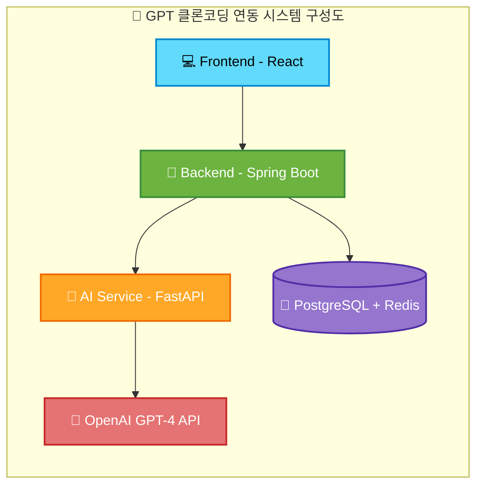

# [🤖 ChatGPT 클론 서비스](https://www.youtube.com/watch?v=Ntmlk_YXLhI)


## `**프로젝트 소개**`
React, Spring Boot, FastAPI로 구현한 ChatGPT 클론 애플리케이션입니다. OpenAI GPT-4 API와 실시간 스트리밍을 통해 원본과 동일한 사용자 경험을 제공합니다.


## `🛠️ 기술 스택`

### 🖥️ Frontend (React)


### ⚙️ Backend (Spring Boot)


### 🤖 AI Service (FastAPI)


### 🔁 Redis


### 🛠️ Redis Commander


### 🗃️ PostgreSQL


### 🐳 Docker & Docker Compose


### 🌐 Nginx


## `설치 및 실행 방법`


### 🐳Docker-compose 기반 전체 서비스 실행

```bash
# 자동 빌드 및 실행 스크립트 사용, 도커 환경 관리
./starts.sh --help

╔══════════════════════════════════════════════════╗
║              🤖 ChatGPT Clone Service            ║
║            Docker Build & Start Script           ║
╚══════════════════════════════════════════════════╝

사용법:
  ./starts.sh [옵션]

옵션:
  -h, --help      이 도움말 표시
  -d, --dev       개발 모드로 실행
  -p, --prod      프로덕션 모드로 실행 (기본값)
  -b, --build     이미지 강제 재빌드
  -c, --clean     모든 컨테이너와 볼륨 정리
  -s, --stop      모든 서비스 중지
  -r, --restart   서비스 재시작
  --fix-ports     포트 충돌 해결
  --status        서비스 상태 확인
  --logs          서비스 로그 확인
  --troubleshoot  문제 해결 도구

예시:
  ./starts.sh -d           # 개발 모드 실행
  ./starts.sh -p -b        # 프로덕션 모드 강제 재빌드
  ./starts.sh -c           # 전체 정리
  ./starts.sh --fix-ports  # 포트 충돌 해결
  ./starts.sh --troubleshoot # 문제 해결

```


## 🌟 주요 특징

### **프롬프트 관리기능 추가**<br><br>
__기본 제공 프롬프트__<br>

<br>
__사용자 전용 프롬프트 관리__<br>

<br>
__사용자 전용 프롬프트 추가__<br>


## 🏗️ 시스템 아키텍처



## 🚀 빠른 시작

### 1. 필수 요구사항

- **Docker & Docker Compose**
- **OpenAI API Key**


## 📋 포트 접속 정보

- **프론트엔드**: 3000
- **백엔드 API**: 8080
- **AI 서비스**: 8000
- **AI API 문서**: 8000
- **PostgreSQL**: 5432
- **Redis**: 6379
- **Redis Commander**: 8081

### AI서버 프롬프트 타입 설정

#### 지원하는 프롬프트 타입

| 타입 | Temperature | Max Tokens | 용도 |
|------|-------------|------------|------|
| **일반 채팅** | 0.7 | 2000 | 균형잡힌 일반 대화 |
| **코드 어시스턴트** | 0.2 | 3000 | 정확한 프로그래밍 지원 |
| **대화 제목 생성** | 0.3 | 50 | 일관된 제목 생성 |
| **감정 분석** | 0.4 | 1500 | 감정 분석 및 코칭 |


### CLI 챗봇에서 프롬프트 변경
```bash
# 고급 챗봇 실행
cd ai
python main.py

# 챗봇에서 명령어 사용
set-prompt 당신은 친근한 한국어 튜터입니다.
set-temp 0.5
set-tokens 1500
show-settings  # 현재 설정 확인
```


## 🔄 API 엔드포인트

### 인증 API
```
POST /api/auth/register    # 회원가입
POST /api/auth/login       # 로그인  
POST /api/auth/logout      # 로그아웃
```

### 채팅 API
```
GET  /api/conversations           # 채팅 목록 조회
POST /api/conversations           # 새 채팅 생성
DELETE /api/conversations/{id}    # 채팅 삭제

POST /api/messages                # 메시지 전송
GET  /api/messages/stream/{id}    # 실시간 스트리밍 (SSE)
```

### 프롬프트 API
```
GET    /api/prompts         # 프롬프트 목록 조회
POST   /api/prompts         # 프롬프트 생성
PUT    /api/prompts/{id}    # 프롬프트 수정
DELETE /api/prompts/{id}    # 프롬프트 삭제
```

### AI 서비스 API
```
POST /api/chat              # AI 채팅 요청
GET  /api/chat/stream       # 스트리밍 채팅 (SSE)
GET  /health               # 헬스 체크
```

## ⚙️ 환경 설정

### .env 파일 설정
```env
# OpenAI API 설정
OPENAI_API_KEY=your-openai-api-key-here

# 데이터베이스 설정
POSTGRES_DB=gpt_clone_dev
POSTGRES_USER=postgres
POSTGRES_PASSWORD=3482

# JWT 설정
JWT_SECRET=mySecretKey123456789012345678901234567890

# AI 서비스 설정
AI_SERVICE_BASE_URL=http://ai-service:8000
AI_SERVICE_TIMEOUT=30

# 기본 AI 모델 설정 (프롬프트별 최적화 설정은 prompt.py에서 관리)
DEFAULT_MODEL=gpt-3.5-turbo
# 참고: temperature, max_tokens는 이제 프롬프트별로 자동 최적화됩니다
```

### Spring Boot 설정 (application.yml)
```yaml
server:
  port: 8080

spring:
  profiles:
    active: docker
  datasource:
    url: jdbc:postgresql://postgres:5432/gpt_clone_dev
    username: postgres
    password: 3482
  data:
    redis:
      host: redis
      port: 6379
  jpa:
    hibernate:
      ddl-auto: update
    show-sql: true

jwt:
  secret: ${JWT_SECRET}
  expiration: 86400000
```

## 📋 주요 기능

### 🔐 사용자 인증
- JWT 기반 회원가입/로그인
- 개인별 채팅 기록 관리
- 안전한 세션 관리

### 💬 AI 채팅
- OpenAI GPT-4와 실시간 대화
- 타이핑 애니메이션과 스트리밍 응답
- 메시지 기록 자동 저장
- 프롬프트별 자동 최적화된 AI 응답

### 📚 지능형 프롬프트 관리
- **중앙집중식 관리**: `prompt.py`에서 모든 프롬프트와 설정 통합 관리
- **프롬프트별 최적화**: 용도에 맞는 temperature, max_tokens 자동 적용
- **CONFIG 기반 구조**: 체계적인 프롬프트-설정 묶음 관리
- **헬퍼 함수 제공**: `get_config()`, `get_prompt()`, `get_temperature()`, `get_max_tokens()`
- **하위 호환성**: 기존 코드 수정 없이 새 기능 활용 가능
- **확장성**: 새로운 프롬프트 타입 쉽게 추가 가능


### 🗂️ 채팅 관리
- 사이드바에서 채팅 목록 확인
- 개별 채팅 삭제 기능
- 빈 채팅 자동 삭제 시스템
- 시간별 채팅 그룹화

### 🎨 UI/UX
- ChatGPT와 동일한 다크 테마
- 말풍선 스타일 메시지 디자인
- 호버 애니메이션 및 트랜지션
- 완전 반응형 디자인


## 📄 라이센스

이 프로젝트는 MIT 라이센스를 따릅니다.

