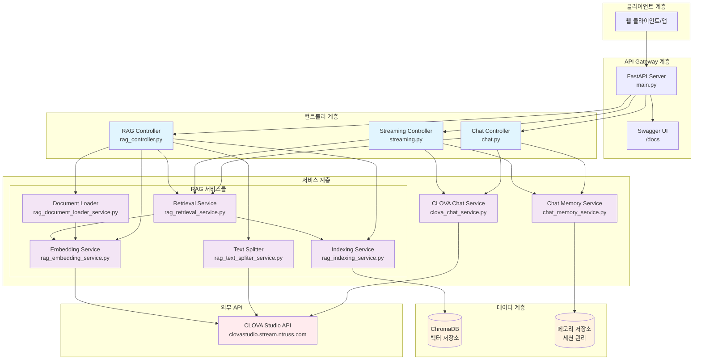
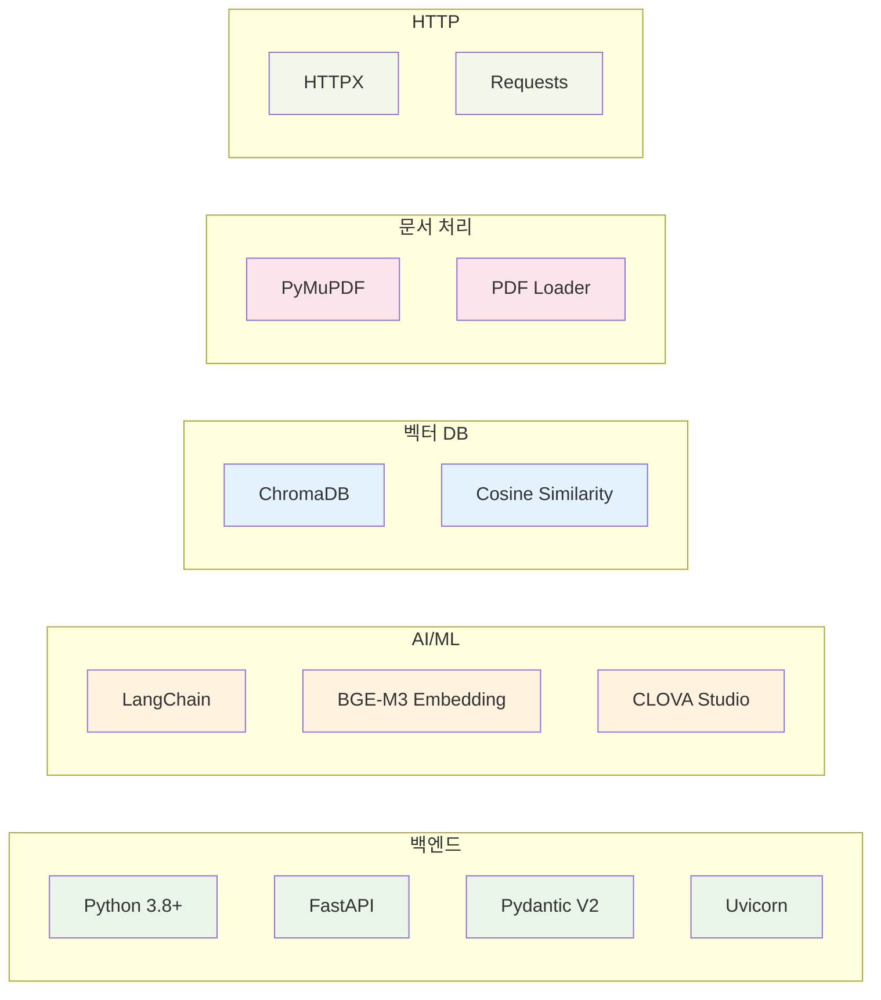
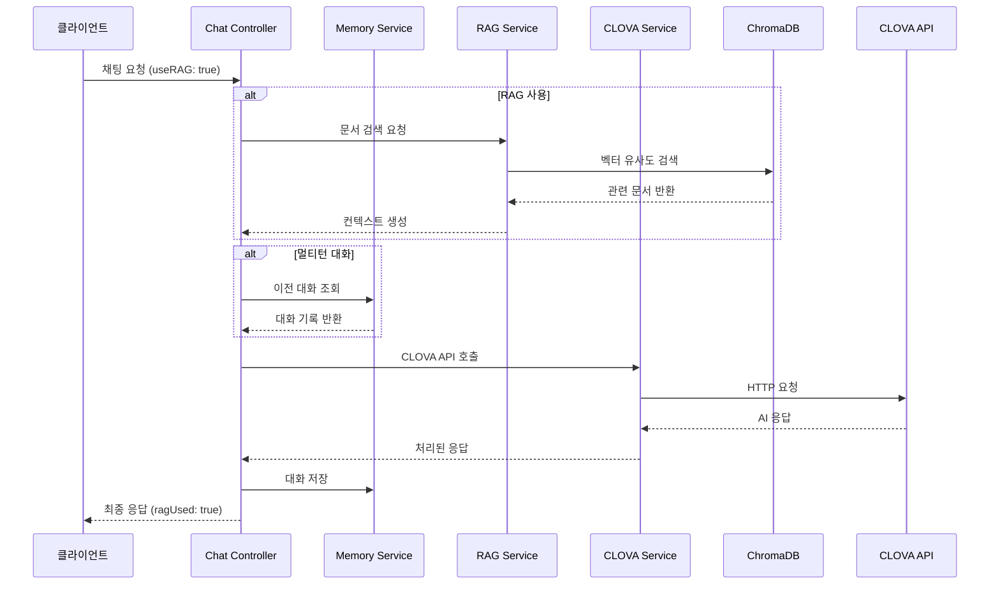
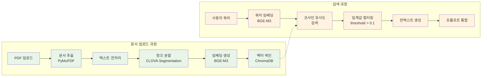
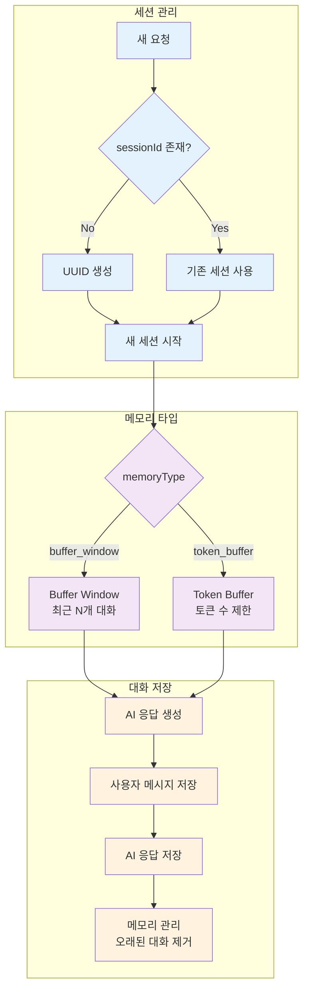

# CLOVAX - CLOVA Studio API Wrapper with RAG

CLOVA Studio API를 FastAPI로 래핑한 서비스입니다. HCX-005와 HCX-DASH-002 모델을 지원하며, 이미지 입력, 스트리밍 응답, RAG(검색 증강 생성) 기능을 포함한 완전한 채팅 시스템을 제공합니다.

## 🚀 주요 기능

### 💬 채팅 기능
- **Chat Completions API**: 일반 채팅 완성
- **Streaming Chat Completions API**: 실시간 스트리밍 응답
- **멀티턴 대화**: 세션 기반 대화 기록 관리
- **메모리 관리**: Buffer Window, Token Buffer 지원

### 🧠 RAG (검색 증강 생성)
- **문서 업로드**: PDF 문서를 벡터 DB에 색인
- **의미 검색**: BGE-M3 임베딩을 통한 유사도 검색
- **컨텍스트 기반 답변**: 검색된 문서를 바탕으로 정확한 답변 생성
- **하이브리드 검색**: 벡터 검색 + 키워드 검색 (확장 가능)

### 🎨 기타 기능
- **이미지 입력 지원**: HCX-005 모델에서 이미지 URL 및 Base64 데이터 지원
- **AI 필터**: 욕설, 차별, 성희롱 등 민감한 콘텐츠 필터링
- **추론 모델 지원**: HCX-005에서 추론 기능 지원
- **요청 ID 추적**: X-NCP-CLOVASTUDIO-REQUEST-ID 헤더 지원
- **완전한 API 문서**: FastAPI 자동 생성 문서

## 🏗️ 시스템 아키텍처



## 💾 기술 스택



## 🔄 채팅 처리 플로우



## 📚 RAG 파이프라인



## 🧠 메모리 관리 시스템



## 📋 지원 모델

### HCX-005 (비전 모델)
- 최대 128,000 토큰 (입력 + 출력)
- 이미지 입력 지원 (최대 5개)
- 추론 모델 지원
- 지원 형식: BMP, PNG, JPG, JPEG, WEBP
- 이미지 크기: 20MB 이하
- 이미지 비율: 1:5 ~ 5:1

### HCX-DASH-002 (경량화 모델)
- 최대 32,000 토큰 (입력 + 출력)
- 텍스트 전용
- 빠른 응답 속도

## 🚫 제한사항

### 모든 모델에서 지원하지 않는 기능
- **Function Calling**: 지원하지 않음
- **Structured Outputs**: 지원하지 않음

### Task API 제한사항
- 이미지 입력 미지원
- 추론 기능 미지원
- Function Calling 미지원
- Structured Outputs 미지원

### 추론 모델 제한사항
- `stop` 파라미터 사용 불가
- `maxTokens`와 `maxCompletionTokens` 동시 사용 불가

## 🛠️ 설치 및 실행

### 1. 의존성 설치
```bash
pip install -r requirements.txt
```

### 2. 환경 변수 설정
`.env` 파일을 생성하고 다음 내용을 추가하세요:

```env
# CLOVA Studio API 설정
CLOVA_STUDIO_API_KEY=your_clova_studio_api_key_here
CLOVA_STUDIO_BASE_URL=https://clovastudio.stream.ntruss.com

# 서버 설정
HOST=0.0.0.0
PORT=8000
RELOAD=false
DEBUG=false
```

### 3. 서버 실행
```bash
python main.py
```

또는 uvicorn을 직접 사용:
```bash
python -m venv venv
source venv/bin/activate  # Windows: venv\Scripts\activate
pip install -r requirements.txt
uvicorn main:app --host 0.0.0.0 --port 8000 --reload --log-level debug
```

## 📖 API 사용법

### 기본 채팅
```json
POST /api/v1/chat-completions/HCX-005
{
  "messages": [
    {
      "role": "user",
      "content": "안녕하세요!"
    }
  ]
}
```

### RAG 기반 채팅
```json
POST /api/v1/chat-completions/HCX-005
{
  "messages": [
    {
      "role": "user",
      "content": "BTS 지민에 대해 알려주세요"
    }
  ],
  "useRAG": true,
  "ragTopK": 3,
  "ragThreshold": 0.1
}
```

### 멀티턴 대화
```json
POST /api/v1/chat-completions/HCX-005
{
  "messages": [
    {
      "role": "user",
      "content": "이전에 무엇을 얘기했나요?"
    }
  ],
  "sessionId": "550e8400-e29b-41d4-a716-446655440000",
  "memoryType": "buffer_window",
  "memoryK": 10
}
```

### 문서 업로드
```bash
curl -X POST "http://localhost:8000/api/v1/RAG/documents/upload" \
  -H "Content-Type: multipart/form-data" \
  -F "file=@document.pdf" \
  -F "document_source=my_document" \
  -F "alpha=-100" \
  -F "post_process_max_size=2000" \
  -F "post_process_min_size=500"
```

## 📊 모니터링

### 헬스체크
```bash
GET /api/v1/RAG/health
```

### 통계 조회
```bash
GET /api/v1/RAG/stats
```

### API 문서
서버 실행 후 다음 URL에서 Swagger 문서를 확인할 수 있습니다:
- **Swagger UI**: `http://localhost:8000/docs`
- **ReDoc**: `http://localhost:8000/redoc`

## 🏃‍♂️ 실행 예시

1. **서버 시작**
   ```bash
   python main.py
   ```

2. **문서 업로드**
   ```bash
   curl -X POST "http://localhost:8000/api/v1/RAG/documents/upload" \
     -F "file=@article.pdf" \
     -F "document_source=news_articles"
   ```

3. **RAG 채팅 테스트**
   ```bash
   curl -X POST "http://localhost:8000/api/v1/chat-completions/HCX-005" \
     -H "Content-Type: application/json" \
     -d '{
       "messages": [{"role": "user", "content": "업로드한 문서에서 BTS 관련 소식을 알려줘"}],
       "useRAG": true
     }'
   ```

## 🔧 개발 가이드

### 프로젝트 구조
```
clovax/
├── main.py                     # FastAPI 애플리케이션 진입점
├── core/
│   └── config.py              # 설정 관리
├── apis/v1/
│   ├── chat_completions/      # 채팅 API
│   │   ├── chat.py           # 일반 채팅
│   │   └── streaming.py      # 스트리밍 채팅
│   └── rag/
│       └── rag_controller.py # RAG API
├── services/                  # 비즈니스 로직
│   ├── clova_chat_service.py # CLOVA API 통신
│   ├── chat_memory_service.py # 메모리 관리
│   ├── rag_*.py              # RAG 관련 서비스들
└── schemas/                   # 데이터 모델
    ├── request/
    └── response/
```

### 확장 가능한 기능들
- **키워드 검색**: 벡터 검색과 함께 사용할 키워드 검색
- **문서 필터링**: 특정 출처나 타입의 문서만 검색
- **리랭킹**: 검색 결과를 다시 정렬하는 고급 기능
- **다중 임베딩**: 여러 임베딩 모델을 동시에 사용
- **실시간 문서 업데이트**: 문서 변경 시 자동 재색인

이 프로젝트는 확장성을 고려하여 설계되었으며, 새로운 기능을 쉽게 추가할 수 있습니다.